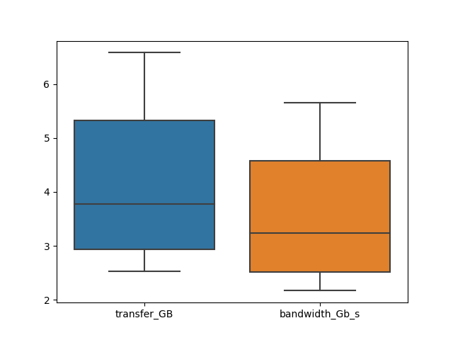
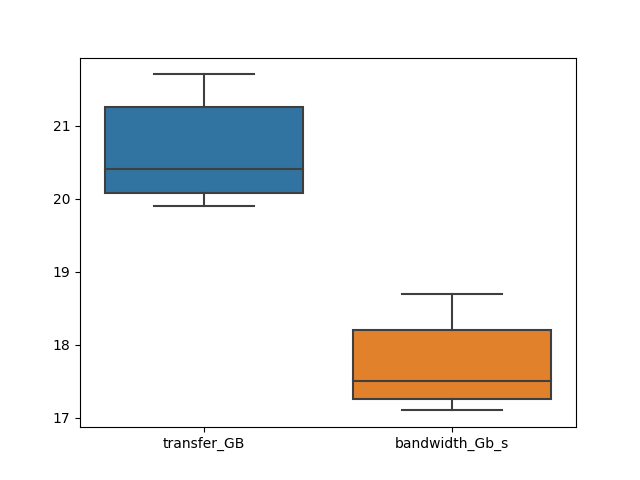

# Resultados 22-06-2023

Para esse teste, usamos um cluster com 3 nós do tipo control plane e 6 nós worker. Cada um dos CP contam com 4 vCPUs e 8 GB de memória, já os worker nodes contam com 8 vCPUs e 16 GB de memória.

## Pods em nós diferentes

Os testes realizados com Pods em nós diferentes indicaram o seguinte resultado:

A média de dados transferidos durante os 10 segundos de testes foram 4.21 GB e a mediana foi de 3.77 GB. Já sobre a largura de rede, a média foi de 3.58 Gb/s e a mediana foi 3.23 Gb/s.

## Pods no mesmo nó

Os testes realizados com Pods no mesmo nó indicaram o seguinte resultado:

A média de dados transferidos durante os 10 segundos de testes foram 20.65 GB e a mediana foi de 20.4 GB. Já sobre a largura de rede, a média foi de 17.74 Gb/s e a mediana foi 17.5 Gb/s.